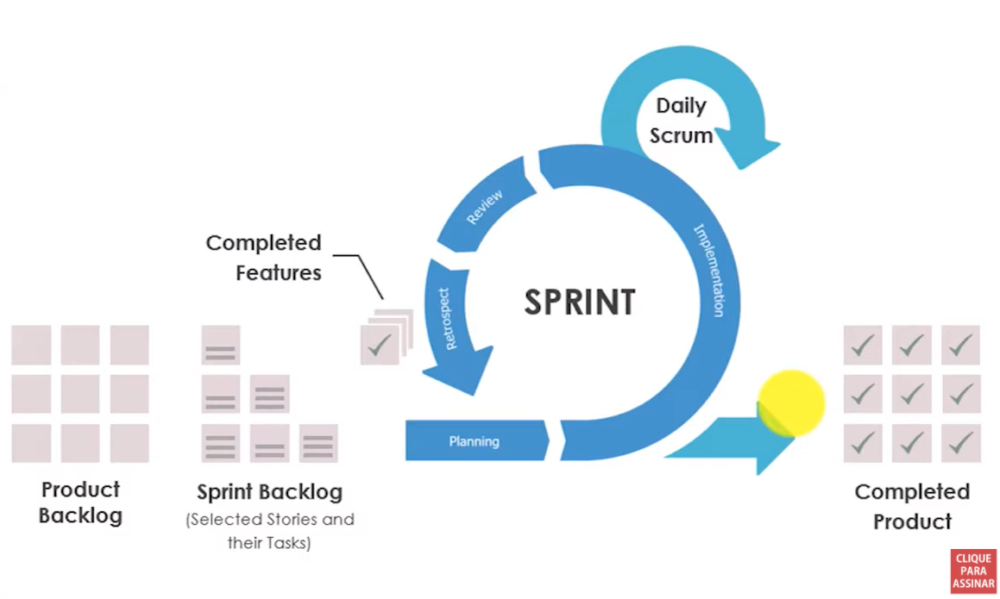
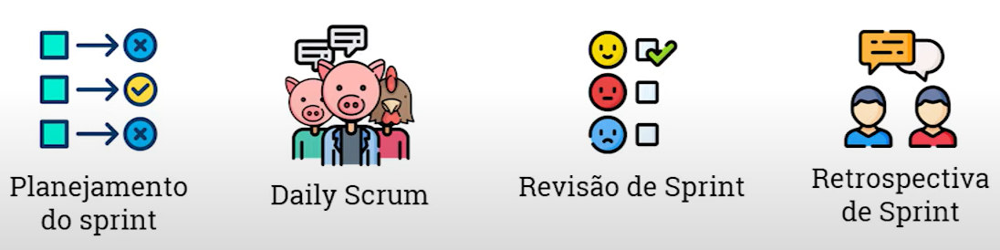
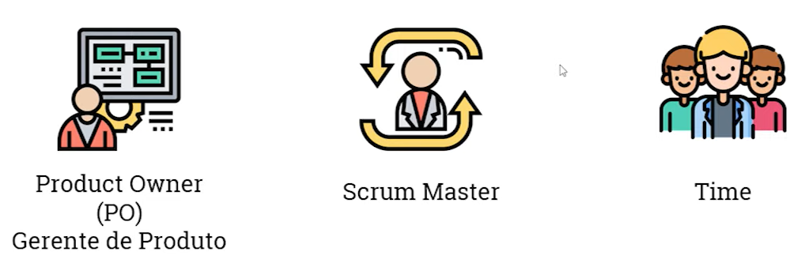

# Scrum

É um framework de gestão de projetos ágeis que permitem aos times entregar, desenvolver ou melhorar um produto complexo. Pode ser aplicado a diversos contextos: RH, Financeiro, Marketing, Jurídico, etc, e diversos outros podem fazer uso do **Scrum** como metodologia para ter entregas mais ágeis, mais baratas e com mais qualidade.

Em **Scrum** as entregas acontecem através de interações chamadas de **Sprint**: é quebrado projetos maiores em ciclos de entrega menores que tornam mais fáceis de gerenciar, controlar e responder as mudanças.

## Como funciona o Scrum?

Quando um time se predispõe a desenvolver um projeto, tudo começa com uma grande lista do que fazer, e no Scrum essa lista é o ***Backlog* do Produto**. Essa grande lista tem as ações, histórias e tarefas que serão entregues. A partir do ***Backlog*** o time seleciona as ações que irá para o **Sprint** (normalmente dura 2 semanas).

 Durante o período de **Sprint** terão algumas cerimônias: são eventos que vão te ajudar a manter a coisa transparente, as pessoas alinhadas ao que vai ser entregue e adaptar-se a mudanças. 

Ao fim de cada Sprint é o início do próximo.

## Cerimônias do Scrum

### Planejamento do Sprint

No planejamento do Sprint seu time vai selecionar os itens que eles serão capazes de entregar no prazo (normalmente de 2 semanas), tendo em mente o objetivo do fim da entrega (por exemplo, entregar a primeira versão do produto). Discutindo:

- Priorização do trabalho;
- Planejamento das entregas;
- Estimativas.

### Daily Scrum

Reunião rápida que acontecerá no mesmo horário e local. Ela tem o objetivo de manter todos alinhados a mesma página, duram normalmente 15 minutos e começam nas primeiras horas do dia. Logo as características são:

- Horário e local sempre iguais;
- Reunião curta e em pé;
- Manter todos na mesma página.

### Revisão do Sprint

Ela acontece no final, na entrega do Sprint. É uma reunião para informar e apresentar ao time PO o que foi entregue, onde o PO revisa o Sprint e dar sua avaliação. Características são:

- Sessão Informal;
- Apresentação do trabalho entregue;
- PO aprova os itens.

### Retrospectiva do Sprint

É uma reunião com objetivo de aprender: ver o que deu certo e o que pode ser melhorado, documentando essa discussão. Revisando o que deu certo na entrega, nas cerimônias, no Sprint, na relação entre as pessoas, etc. Suas características são:

- O que deu certo?
- O que pode melhorar?
- Retrospectiva.

## Personas do Scrum

No Scrum existem diversos personagens, vamos entender os papéis de cada um no processo.

### Gerente de Produto (PO)

O *Product Owner* (PO) é o responsável pelo produto. Ele está conectando o mercado, consumidor, time e o produto em si. Ele trará visão sobre os mundos, e terá entendimento maior sobre o negócio e dos seus requisitos.

- Responsável pelo produto;
- Mercado, Consumidor, Produto(visão);
- Entendimento de negócio e requisitos.

### Scrum Master

É o especialista de *Scrum* dentro do time, tendo papel didático e consultivo. Ele treinará o time, a empresa, dono de empresa, entre outros, nas práticas do Scrum, vivenciando cerimônias e etc.

- Especialista em Scrum dentro do time;
- Papel didático e consultivo.

> Não confunda *Scrum Master* com Líder Técnico.

### Team

A equipe que entregará os itens priorizados dentro do Sprint. Junto com o PO trará previsão das entregas e contribuirá para melhorias das entregas.

- Entrega dos itens priorizados;
- Previsão de entregas;
- Contribuição para melhorias da entrega.